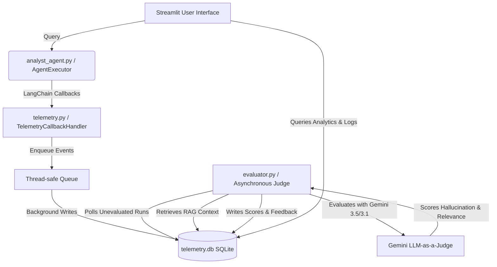
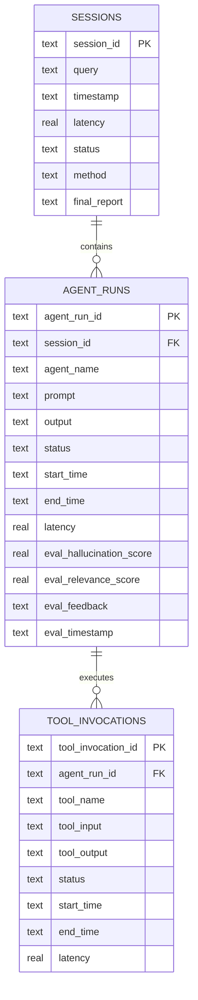

# Digital Junior Analyst — Telemetry Observability & Evaluation System

An end-to-end telemetry and observability platform for the **Digital Junior Analyst** ReAct agent. This system instruments LangChain agent execution, logs all traces (sessions, runs, and tool invocations) into a relational SQLite database, runs asynchronous "LLM-as-a-Judge" evaluations to detect hallucinations, and renders a live, premium Command Center dashboard directly in the Streamlit user interface.

---

## 📡 System Architecture

The observability architecture is divided into four distinct layers:



1. **Instrumentation Layer** (`telemetry.py`): Uses LangChain's callback system (`BaseCallbackHandler`) to hook into chain (`on_chain_start`, `on_chain_end`, `on_chain_error`) and tool (`on_tool_start`, `on_tool_end`, `on_tool_error`) events.
2. **Relational Storage Layer** (`telemetry.db`): Structured local SQLite database storing sessions, individual agent runs, and granular tool inputs/outputs.
3. **Evaluation Engine** (`evaluator.py`): A background worker thread utilizing Gemini models (`gemini-3.5-flash` with a robust fallback to `gemini-2.0-flash` and `gemini-3.1-flash-lite`) to grade the agent's output against retrieved document contexts.
4. **Command Center UI Dashboard** (`app.py`): A tabbed interface displaying global health KPIs, detailed drill-down execution logs, and historical quality trend visualizations.

---

## 🗄️ Database Schema Design

The telemetry schema links high-level sessions to specific sub-agent executions and tool invocations:



---

## 🚀 Installation & Local Setup

### 1. Prerequisites
Ensure you have Python 3.11+ installed.

### 2. Install Dependencies
Install all required libraries, including modern Google GenAI and LangChain packages:
```bash
pip install -r requirements.txt
```

### 3. Environment Configuration
Create a `.env` file in the root of the project directory and configure your Gemini API Key:
```env
GEMINI_API_KEY=AIzaSy...
```

---

## 🖥️ Running the Application

Launch the Streamlit app:
```bash
streamlit run app.py
```
- **Run Queries**: Use the **Instant Report** tab to ask questions (e.g. *Analyze ACME Corp's leverage ratio*).
- **Audit Traces**: Open the **Telemetry Command Center** tab to monitor sessions, run-times, latencies, nested tool inputs/outputs, and quality metrics in real-time.

---

## ⚖️ Asynchronous LLM-as-a-Judge Evaluator

The evaluator polls the database for completed agent runs and scores them using the following criteria:
- **Context Relevance Score (0-100)**: Grades how helpful the retrieved context documents were in addressing the user's query.
- **Hallucination Score (0-100)**: Detects whether the generated agent report contains facts, names, or numbers that are not supported by the retrieved context. (0 = no hallucinations, 100 = completely fabricated).

### Model Failover & Resilience
To prevent outages due to rate-limiting (`429`) or temporary service issues (`503`), the evaluator incorporates automatic model failovers:
1. `gemini-3.5-flash` (Primary)
2. `gemini-2.0-flash` (First Fallback)
3. `gemini-3.1-flash-lite` (Second Fallback)

---

## 🧪 Testing the Telemetry Pipeline

An automated verification test script `test_telemetry.py` is included to validate the entire logging queue, relational database updates, and Gemini evaluator integration:

```bash
python test_telemetry.py
```

Upon successful execution, the test script outputs:
```text
=== Starting End-to-End Telemetry Integration Test ===
[INFO] Initializing vector store with demo documents...
[INFO] Starting telemetry logging thread...
[QUERY] Executing query...
[SUCCESS] Session completed!
[INFO] Verifying SQLite records...
  - Session status: SUCCESS
  - Logged tool invocations: ['rag_retrieval']
[SUCCESS] DB schema and log capture verified successfully!
[INFO] Launching Gemini Evaluator loop (once=True)...
[Gemini Evaluator] Evaluated run: Hallucination=0, Relevance=100
=== ALL TESTS PASSED SUCCESSFULLY ===
```
